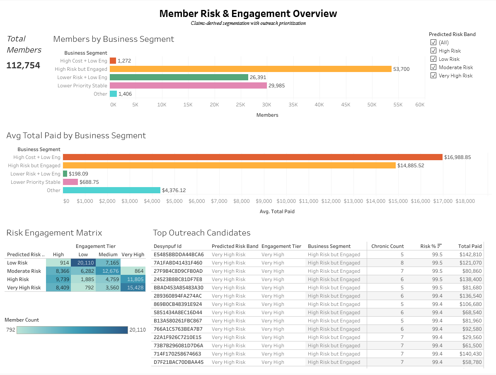
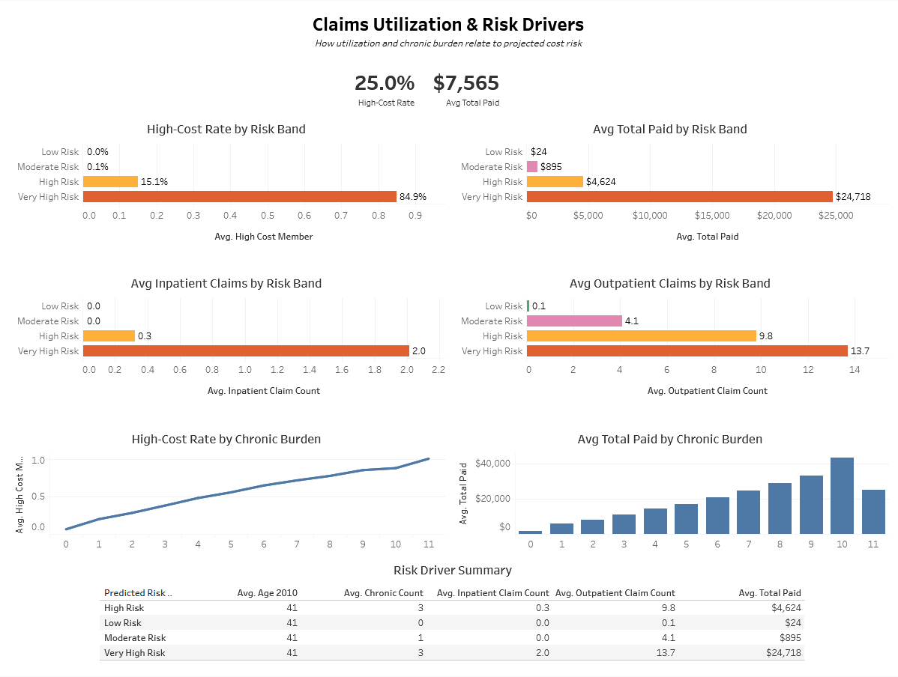

# Health Insurance Claims & Member Engagement Risk Analysis

This project explores how a health insurer could combine claims and engagement data to identify high-risk members, understand utilization patterns, and prioritize outreach.

## Why This Project Matters

Health insurers do not just need to know who is expensive. They need to understand which members are driving utilization, how chronic burden relates to cost, and where lower engagement may signal a need for outreach. This project shows how claims and engagement data can be combined into a more actionable member-level risk view.

## Overview

This project simulates how a health insurer could combine claims and engagement data to better understand:

- which members are likely to be high cost
- how utilization changes across risk groups
- how chronic burden relates to projected cost
- which members may need outreach despite lower engagement

I built a member-level analytical dataset from beneficiary, inpatient, and outpatient claims, engineered utilization and cost features, simulated engagement signals, and created two Tableau dashboards to present the results.

## Data

Built from **CMS DE-SynPUF synthetic beneficiary, inpatient, and outpatient claims files**, plus simulated member engagement features such as portal logins, app sessions, care reminder clicks, telehealth scheduling, and preventive content views.

## Tools

- Python
- pandas, numpy, matplotlib, scikit-learn
- Jupyter Notebook
- Tableau Public

## What I did

- cleaned and profiled CMS synthetic claims files
- built member-level inpatient and outpatient utilization features
- created chronic burden and cost-based risk features
- simulated engagement variables and outreach-priority logic
- built logistic regression and random forest models for high-cost member prediction
- created Tableau dashboards for segmentation, utilization, and risk-driver analysis

## Tableau Dashboards

### Dashboard 1 — Member Risk & Engagement Overview
Shows:
- business segment distribution
- risk band vs engagement tier
- average paid amount by segment
- top outreach candidates

**Tableau Public:**  
[Dashboard 1: Member Risk & Engagement Overview](https://public.tableau.com/views/HealthInsuranceClaimsMemberEngagementRiskAnalysisRiskOutreachOverview/Dashboard1-RiskEngagementOverview?:language=en-US&:sid=&:redirect=auth&:display_count=n&:origin=viz_share_link)

### Dashboard 2 — Claims Utilization & Risk Drivers
Shows:
- high-cost rate by risk band
- average paid amount by risk band
- inpatient and outpatient utilization patterns
- chronic burden relationships
- risk driver summary

**Tableau Public:**  
[Dashboard 2: Claims Utilization & Risk Drivers](https://public.tableau.com/views/HealthInsuranceClaimsMemberEngagementRiskAnalysisUtilizationRiskDrivers/Dashboard2-ClaimsUtilizationRiskDrivers?:language=en-US&:sid=&:display_count=n&:origin=viz_share_link)

## Key Takeaways

- Higher-risk members tended to generate much higher overall costs.
- Members in higher-risk groups also used more healthcare services.
- Chronic condition burden was closely tied to higher cost risk.
- Combining risk and engagement signals helped highlight members who may benefit from earlier outreach.

## Files in This Repo

- `notebooks/` — project notebooks from data prep through modeling and Tableau exports
- `data_processed/` — cleaned and engineered project files
- `screenshots/` — dashboard screenshots
- `tableau/` — Tableau workbook links/files
- `docs/` — CMS reference documents

## Notes

This is a portfolio project built on **synthetic claims data** with **simulated engagement data**, so it should be interpreted as a risk analytics and healthcare analytics workflow demonstration rather than a production insurance model.

## Future Improvements

Given more time, I would:

- build a more forward-looking prediction setup using prior-period features only
- expand feature engineering with additional provider and service-level claims features
- add a more explicit anomaly detection workflow for unusual utilization or cost patterns
- refine the engagement simulation logic to better reflect different member behavior profiles
- extend the Tableau layer with more intervention-focused views for care management and outreach
